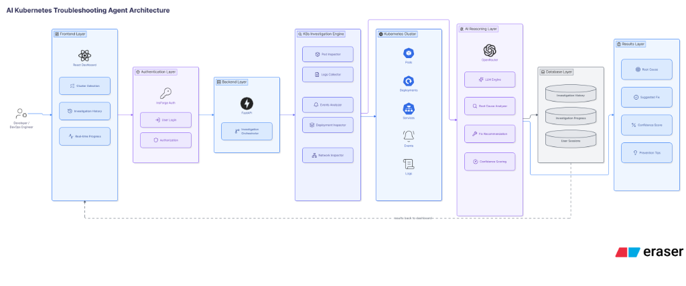
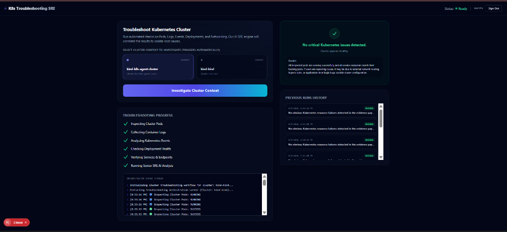
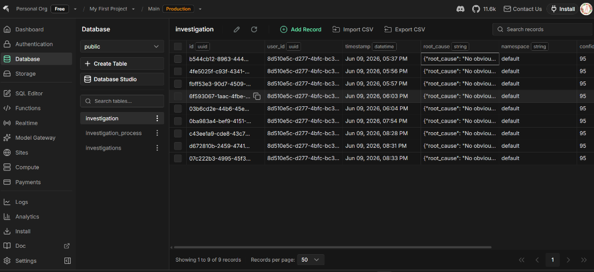
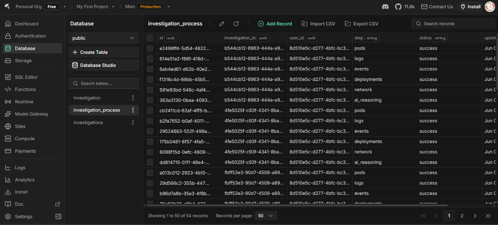

#  AI Kubernetes Troubleshooting Agent

An on-demand, intelligent SRE assistant designed to automate cluster diagnostics. It connects to your Kubernetes contexts, collects resource status, analyzes pod failures, retrieves container logs, correlates system events, validates service/endpoint routing, and leverages advanced LLM reasoning (via OpenRouter) to identify the root cause of issues and suggest actionable fixes.

---

##  Architecture

The system consists of a Next.js frontend, a FastAPI backend orchestrator, a Kubernetes investigation layer utilizing the `kubectl` CLI, and an InsForge BaaS integration (Postgres DB, Authentication, and Realtime pub/sub).

Here is the high-level architecture diagram of the system:



### Architecture Highlights
* **Frontend Layer**: Next.js dashboard providing interactive cluster selection, real-time event streaming of diagnostic steps, investigation run histories, and root-cause summaries.
* **Authentication Layer**: InsForge Authentication managing secure login and session storage.
* **Backend Layer**: FastAPI orchestrator managing the diagnostics pipeline and compiling evidence payloads for the LLM.
* **K8s Investigation Engine**: Modulates specific inspection modules:
  * **Pod Inspector**: Finds crash loops, failing states, restarts, and resource issues.
  * **Logs Collector**: Automatically extracts container logs from failing pods.
  * **Events Analyzer**: Checks Kubernetes system warning events in the namespace.
  * **Deployment Inspector**: Verifies replica counts, rollout history, and pod availability.
  * **Network Inspector**: Validates Service definitions and matching Endpoint routing mappings.
* **AI Reasoning Layer**: Performs reasoning via OpenRouter API using LLM analysis to calculate confidence, diagnose root causes, recommend mitigation CLI commands, and outline prevention strategies.
* **Database & Persistence**: InsForge Postgres DB schemas that persist history and process flows.

---

##  Screen Walkthrough

### Interactive SRE Dashboard
From the frontend panel, you can choose configured Kubernetes contexts (e.g. `kind` clusters), initiate deep diagnostic sweeps, monitor live event streams, and read through markdown-formatted root-cause diagnoses.



### InsForge Database Persistence
The agent tracks each diagnostic step in real-time, storing investigations and process state machines inside InsForge tables:

* **`investigation` Table**: Stores metadata of the run, the namespace checked, confidence metrics, and final root-cause analysis payloads.


* **`investigation_process` Table**: Stores the execution state of each automated check (e.g. `pods`, `logs`, `events`, `deployments`, `network`, `ai_reasoning`) with timestamps and statuses (`running`, `success`, `failed`).


---

##  Running the Application

###  Prerequisites
* [Docker](https://www.docker.com/) and [Docker Compose](https://docs.docker.com/compose/)
* A running Kubernetes cluster (e.g. [Kind](https://kind.sigs.k8s.io/) or [Minikube](https://minikube.sigs.k8s.io/))
* A configured `kubeconfig` file (usually located at `~/.kube/config`)

###  Setup & Configuration

1. **Backend Environment**:
   Copy the example environment file in the `backend` folder and populate it with your OpenRouter API key and InsForge credentials:
   ```bash
   cp backend/.env.example backend/.env
   ```
   Add your backend environment configurations:
   * `OPENROUTER_API_KEY`: Your model gateway API key.
   * `INSFORGE_PROJECT_URL` & `INSFORGE_ANON_KEY`: Found in the InsForge backend metadata.
   * `KUBECONFIG_PATH`: Point this to `/app/.kube/config` within the container.

2. **Frontend Environment**:
   Copy the example environment file in the `frontend` folder:
   ```bash
   cp frontend/.env.example frontend/.env.local
   ```
   Provide the URL for the FastAPI backend and InsForge client configs.

3. **Kubernetes Configuration Mounting**:
   The `docker-compose.yml` mounts your local `.kube` configuration directory to the backend container to allow the agent to run `kubectl` queries. By default, it maps:
   ```yaml
   volumes:
     - ~/.kube:/app/.kube:ro
   ```
   *Make sure your current kubeconfig is active and pointing to the intended context.*

###  Spinning Up Services

To build the images and run the full stack in Docker containers:

```bash
docker compose up --build
```

Once running, you can access the services:
* **Frontend SRE Dashboard**: [http://localhost:3000](http://localhost:3000)
* **Backend API Documentation (Swagger)**: [http://localhost:8000/docs](http://localhost:8000/docs)
* **Backend Health Check**: [http://localhost:8000/health](http://localhost:8000/health)

---

##  Testing Scenarios
The `test-scenarios/` directory contains standard Kubernetes configurations with deliberate errors to test the agent's diagnostic logic:
* `crashloopbackoff.yaml`: Simulates a pod crashing repeatedly on launch.
* `imagepullbackoff.yaml`: Simulates a pod reference to a non-existent container registry or image.
* `oomkilled.yaml`: Simulates a pod that exceeds its memory limits.
* `service-selector-mismatch.yaml`: Simulates a Service configuration mapping to a selector that targets zero pods.

To apply a test scenario:
```bash
kubectl apply -f test-scenarios/crashloopbackoff.yaml
```
Once applied, choose the corresponding cluster context in the SRE Dashboard and click **Investigate Cluster Context** to see the agent detect the failure, inspect logs, extract system warning events, identify the root cause, and suggest fixes.
